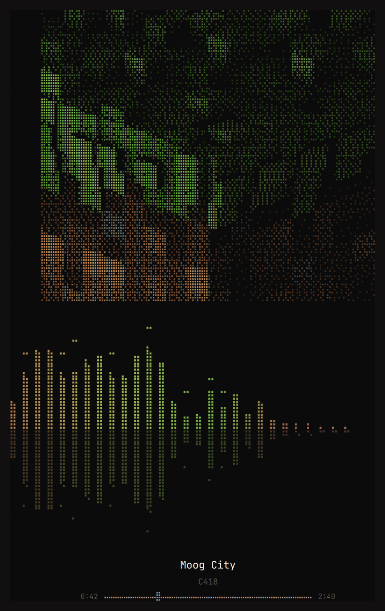
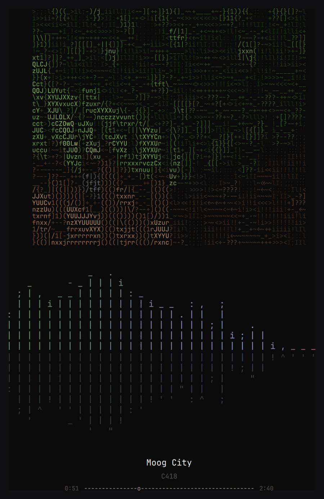
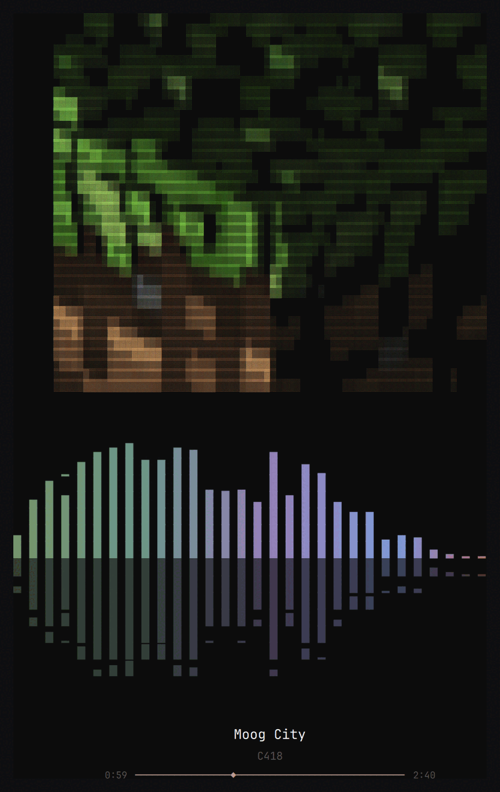
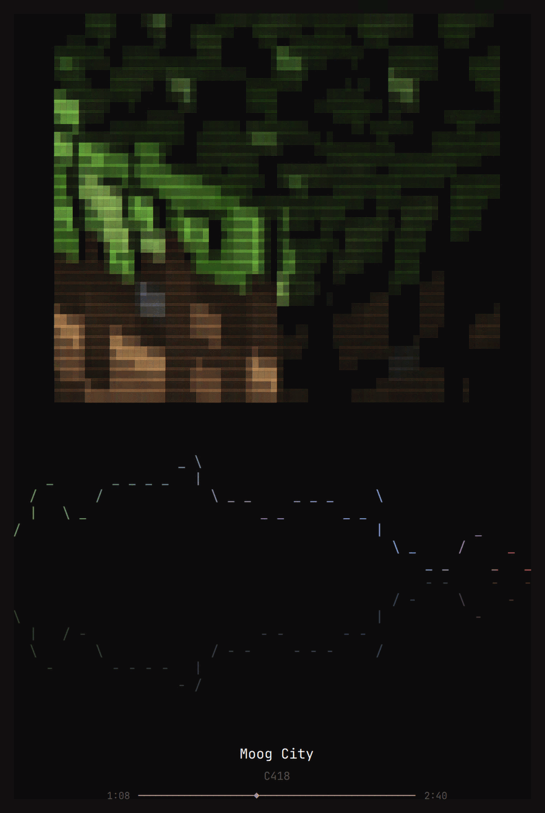

# Music Saver

An Omarchy screensaver for when music is playing: the album art redrawn as
coloured text — braille halftone out of the box, ASCII or blocks a setting
away — a mirrored spectrum of whatever is actually coming out of the speakers,
painted in the cover's own colours, and the track it belongs to.

Idle with nothing playing and Omarchy's own screensaver still takes over. This
one only appears when a player reports something is playing — and `showWhenIdle:
false` keeps it off the idle path entirely, leaving it something you open
yourself.

 

<p align="center">
  
  
</p>
<p align="center">
  <em><code>style: dots</code>, <code>colors: cover</code> &nbsp;·&nbsp; <code>style: ascii</code>, <code>colors: theme</code></em>
</p>

---

## Install

```bash
omarchy plugin add https://github.com/MrHogun/omarchy-music-saver.git --enable
~/.config/omarchy/plugins/mrhogun.music-saver/install.sh   # menu entry, dependency check
omarchy restart shell
```

`omarchy plugin add` is Omarchy's own way in: it clones the repo straight into
`~/.config/omarchy/plugins/<id>/`, validates the manifest against the same
rules the shell enforces, and enables it. It runs no script of the plugin's —
by design, and worth knowing about any plugin you install — so the second line
is the part that adds the menu entry and tells you if anything it needs is
missing. Skip it and everything still works, just without the menu row.

From a clone, `./install.sh` does the whole thing, copy included:

```bash
git clone https://github.com/MrHogun/omarchy-music-saver
cd omarchy-music-saver
./install.sh
omarchy restart shell
```

Try it without waiting out the idle timer:

```bash
omarchy-shell music-saver show
```

The setup script also puts it in the Omarchy menu, under **System › Screensaver**:

```
Screensaver ›
   Default       the stock screensaver
   Musicsaver    this one, shown only while something is playing
```

That is done by adding a marked block to
`~/.config/omarchy/extensions/omarchy-menu.jsonc` — the file Omarchy keeps for
exactly this — which reuses the `system.screensaver` id to turn that row into a
submenu and hangs two children off it. Nothing else in the file is touched.

It has to be a child rather than a row next to Screensaver: the menu merges
Omarchy's rows first and appends the user's, and a re-declared id keeps the
position it already had, so any new id lands at the bottom of its submenu —
under Shutdown, in this case. A child is the only place next to Screensaver
that an extension can reach.

Remove it with `./install.sh uninstall` (or `omarchy plugin remove
mrhogun.music-saver`, which leaves the menu block behind — run the script's
uninstall first). The script takes exactly that block back out; the stock row
returns on its own, because it was never edited.

Needs `python3`, plus `pw-cat` (PipeWire) for the spectrum and `ffmpeg` /
`ffprobe` for the cover — all of which a normal Omarchy install already has. It
runs inside the long-lived `omarchy-shell` process like every Omarchy plugin,
unsandboxed; the code is `Service.qml` and two short Python scripts, and it is
worth a read before you enable it.

---

## What it draws

**Album art as coloured text.** Players cache the cover on disk and point MPRIS
at it, so this reads a local file rather than the network. `ffmpeg` scales it,
and each cell gets a character chosen by luminance from the ramp the current
[style preset](#settings) names, coloured like the pixel it stands for. The height is worked out from the source's own
proportions and then halved, because a character cell is about twice as tall as
it is wide — covers are not always square, and YouTube Music in particular hands
out 16:9 video thumbnails that a square assumption squashes.

**A mirrored spectrum**, in whichever glyphs the style preset names, growing up
and down from a centre line, coloured across the theme's own terminal palette -- cool in the bass,
warm at the top. Five things borrowed from people who have done this well make
it read as music rather than noise:

- *Monstercat smoothing* — each bar pushes its neighbours up, falling off with
  distance. `cava`'s trick; without it 32 narrow bars twitch like needles.
- *Peak markers with slow falloff* — the `▔` hanging above each column marks the
  recent maximum and sinks more slowly than the bar. `cli-visualizer` calls this
  falloff, and it is what turns a spectrum into rhythm.
- *Attack and decay* — bars snap up and ease down, rather than tracking the
  signal exactly. Showing a raw FFT is the classic mistake: it flickers and
  never lines up with what you hear.
- *A-weighting* — the ear is far less sensitive to low frequencies, so an
  unweighted spectrum is all bass: the left slams while the right barely moves.
  Each band is weighted by the standard curve, at 60% strength because the full
  curve kills the bottom two octaves outright.
- *Auto sensitivity* — cava's `autosens`. The analyser remembers how loud the
  last few seconds were and scales to that, so a quiet track still fills the
  display and a loud one does not sit pinned at the top.

**A decrypt intro.** The title and artist land as scrambled glyphs and resolve
into themselves over about a second — the same effect Omarchy's stock
screensaver uses on its wordmark (`ttfx decrypt`).

**Track position** as a rule with a marker, in the same block glyphs.

**Colour comes from the theme, all of it.** The shell surfaces five colours to
QML, and in most themes `accent` sits right next to `urgent` -- a gradient
between them is barely a gradient. So this reads the theme's `colors.toml`
directly and spreads the spectrum across its terminal palette
(green → cyan → magenta → blue → red), with height lifting each towards the
foreground so peaks read as hot. The file is watched, so `omarchy theme set`
recolours everything with no further work.

**It wakes on the same keys the stock screensaver wakes on, and no others.**
That one waits on `read -n1` -- a character from stdin -- so volume and
brightness keys never reach it: they are `XF86` binds with `locked = true`,
handled by the compositor, producing no text. This matches that, so the volume
can be changed or a track skipped without losing the view.

---

## How it fits together

| File | Role |
|---|---|
| `manifest.json` | declares the plugin: `kind: service`, `keepLoaded` |
| `Service.qml` | idle watch, MPRIS, the overlay window, all the drawing |
| `bin/spectrum.py` | reads the default sink's monitor, prints one line of bar levels per frame |
| `bin/art.py` | turns the cover into coloured rich text — ramped or dithered — once per track |

The spectrum analyser is a plain stdout stream — 32 values in 0..1, about 30
times a second — and useful on its own:

```bash
python3 bin/spectrum.py | head -3
```

There is no numpy: the FFT is a textbook radix-2 over 512 points, a few thousand
operations per frame, which is nothing next to the audio it is reading.

## Commands

```bash
omarchy-shell music-saver show           # open it now
omarchy-shell music-saver hide           # close it
omarchy-shell music-saver playing        # what it thinks is playing
omarchy-shell music-saver help           # every key, its values, what is set
omarchy-shell music-saver config         # the settings in force, as JSON
omarchy-shell music-saver style ascii    # switch style preset, live
omarchy-shell music-saver spectrum dots  # switch how the spectrum is drawn
omarchy-shell music-saver colors cover   # paint it in the cover's colours
omarchy-shell music-saver showWhenIdle off   # stop it taking over the screensaver
omarchy-shell music-saver artWidth 88    # widen the cover, live
```

It closes on any key, a click, or a mouse move of more than 40 px — enough that
a resting hand does not dismiss it.

---

## Settings

Omarchy keeps every plugin's settings **inline on its entry** in
`~/.config/omarchy/shell.json` — no `config:` block, no per-plugin file, no
merge layers. This plugin is a service, so its entry lives in `plugins[]`:

```json
{
  "version": 1,
  "plugins": [
    {
      "id": "mrhogun.music-saver",
      "style": "dots",
      "spectrum": "auto",
      "colors": "cover",
      "artWidth": 72
    }
  ]
}
```

| Key | Values | Default | What it does |
|---|---|---|---|
| `style` | `ascii`, `blocks`, `dots` | `dots` | which alphabet draws the cover |
| `spectrum` | `auto`, `bars`, `ascii`, `density`, `wave`, `dots` | `auto` | how the spectrum is drawn |
| `colors` | `theme`, `accent`, `cover` | `cover` | where the spectrum takes its colour from |
| `artWidth` | 24–120 | `72` | cover width in characters |
| `showWhenIdle` | `true`, `false` | `true` | whether idling into the screensaver hands over to this one |

**`ascii`** draws the cover with the classic 70-glyph density ramp
(`` .'`^",:;Il!i…$@``): shape and texture, a cover that reads as a drawing.
**`blocks`** draws it with the five shaded block glyphs (` ░▒▓█`): flatter, and
closer to a photograph at small sizes. **`dots`** does not use a ramp at all:
braille carries a 2×4 grid of dots per cell, so the cover is sampled eight
times as densely and turned into a one-bit image — Floyd–Steinberg dithered,
its own contrast range opened out first, then coloured per cell from the dots
that are actually lit. A newspaper halftone, in a terminal.

The preset carries the whole screen: on `ascii` the falloff markers become `-`
and `_`, the progress rule becomes `---o---`, and the spectrum switches
alphabet too — `spectrum: auto` means `bars` under `blocks` and `ascii` under
`ascii`. Name one explicitly to mix them:

| `spectrum` | Draws | Idea |
|---|---|---|
| `bars` | `▁▂▃▄▅▆▇█` | eighths of a cell filled from the bottom — the smooth bar everyone knows |
| `ascii` | `_ . , : ; i \|` up, `' " ^ : ; ! \|` down | ASCII cannot move ink inside a cell, so pick a glyph whose ink already sits where the fill would be — aalib's trick, per cell. A full cell is a bar, so it gets the one glyph that *is* a bar |
| `density` | `. , : ; = + * #` | the other ASCII tradition: weight of ink, not position. Reads as a heat map |
| `wave` | `_ / \ \|` | a contour tracing the top of the spectrum, risers drawn in so the line never breaks — an oscilloscope rather than a bar chart |
| `dots` | `⣀⣤⣶⣿` / `⠉⠛⠿⣿` | braille packs four rows into a cell, the trick btop and gotop use for graphs smoother than the terminal grid allows. Reads as an LED equaliser |

Both are watched live — edit `shell.json` and the screen is redrawn without a
restart.

<p align="center">
  
  
</p>
<p align="center">
  <em><code>style: blocks</code> &nbsp;·&nbsp; the same, with <code>spectrum: wave</code></em>
</p>

### Colour

| `colors` | Where it comes from |
|---|---|
| `theme` | the theme's own terminal palette, green → cyan → magenta → blue → red across the spectrum |
| `accent` | one colour, the theme's accent — the quietest of the three |
| `cover` | colours pulled out of the album art |

`cover` is the one that needs a rule, because the obvious approaches all fail:
the average of a cover is mud, and its most common colour is usually its
background. So `art.py palette` throws away everything that is not a colour —
under 22% saturation or 25% value — buckets what is left by hue into 15°
steps, and weights each pixel by `saturation × value`, so a handful of vivid
pixels outrank a wash of grey ones. The heaviest buckets win, but only if they
sit at least 30° from every bucket already picked: neighbouring hues are the
same colour at this size, and a gradient between them is a gradient between
nothing and nothing. Each survivor is then pushed back up to at least 55%
saturation and 72% value — averaging a bucket always comes back duller than the
pixels in it — and the results are sorted by hue so they read as a ramp.

The shell adds the last step, because only it knows the theme: every colour is
checked against the background's luminance and moved towards white (or, on a
light theme, towards black) until it is legible. A dark blue on a dark
background is not a spectrum, it is a rumour. A cover with no colour in it at
all — plenty are pure greyscale — falls back to the theme palette.

The defaults and the option list are declared in `manifest.json` under
`settings`, so there is one description of what the knobs are; the plugin reads
them from its own manifest and layers the user's entry on top. Writes made
through `omarchy-shell music-saver style …` go back through the shell's
`updateEntryInline`, which is the sanctioned way to change `shell.json` —
the plugin never writes that file itself.

> Third-party plugins are not handed their settings by the shell: a service
> receives only its manifest and a capability-scoped shell api, so it reads its
> own entry out of `shell.json` (watched, hence live). Manifests may also
> declare a `settingsForm`, but Omarchy 4.0 ships no renderer for one, so there
> is no settings GUI yet — the file and the IPC commands are the interface.

## Tuning

Past the settings above, the rest is source-level:

| Where | Knob |
|---|---|
| `Service.qml` | `barCount`, `rowCount`, `peakFall`, `pixelSize` |
| `bin/spectrum.py` | `BARS`, `FPS`, `RISE`, `FALL`, `SPREAD`, `LOW_HZ`, `HIGH_HZ` |
| `bin/art.py` | `RAMPS` — the luminance ramps the presets name |

## Known edges

- The analyser follows the **default sink**, captured with
  `stream.capture.sink` on the sink's own node — a sink's monitor is not a
  separate node, so asking for `<sink>.monitor` finds nothing. It also resolves
  the node **id** rather than passing a name: `pw-cat --target` treats a name it
  cannot resolve as a cue to fall back to the default *source*, silently, which
  turns the whole thing into a microphone visualiser that looks like it works.
- Rich text with one span per cell is not free; the cover is redrawn only when
  the track changes, never per frame.
- Omarchy's own idle service keeps running. This overlay sits on the overlay
  layer above it, so the stock screensaver may still be started underneath.

## Credits

Ideas taken from [cava](https://github.com/karlstav/cava) (Monstercat smoothing,
mirrored spectrum) and [cli-visualizer](https://github.com/PosixAlchemist/cli-visualizer)
(peak falloff). Built with [Claude Code](https://claude.com/claude-code).

## License

MIT — see [LICENSE](LICENSE).
